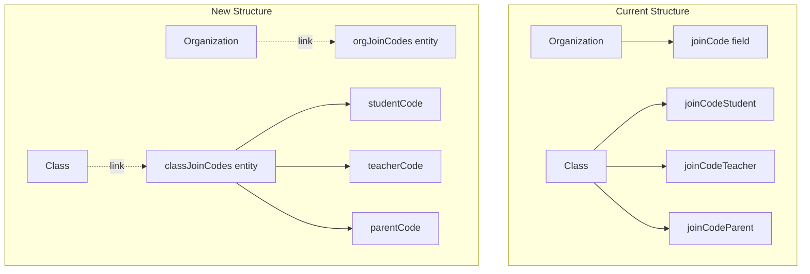

# Secure Join Codes with Separate Entities

## Architecture Overview




## 1. Schema Changes

Update [`src/instant.schema.ts`](src/instant.schema.ts):**Add new entities:**

```typescript
orgJoinCodes: i.entity({
    code: i.string().unique().indexed(),
}),
classJoinCodes: i.entity({
    studentCode: i.string().unique().indexed(),
    teacherCode: i.string().unique().indexed(),
    parentCode: i.string().unique().indexed(),
}),
```

**Add new links:**

```typescript
orgJoinCodeLink: {
    forward: { on: "organizations", has: "one", label: "joinCodeEntity" },
    reverse: { on: "orgJoinCodes", has: "one", label: "organization", onDelete: "cascade" },
},
classJoinCodeLink: {
    forward: { on: "classes", has: "one", label: "joinCodeEntity" },
    reverse: { on: "classJoinCodes", has: "one", label: "class", onDelete: "cascade" },
},
```

**Remove fields from existing entities:**

- Remove `joinCode` from `organizations`
- Remove `joinCodeStudent`, `joinCodeTeacher`, `joinCodeParent` from `classes`

## 2. Permissions Changes

Update [`src/instant.perms.ts`](src/instant.perms.ts):**Add new permission rules:**

```typescript
orgJoinCodes: {
    allow: {
        create: "isAuthenticated",
        view: "isAuthenticated && (auth.id in data.ref('organization.owner.id') || auth.id in data.ref('organization.admins.id'))",
        update: "isAuthenticated && (auth.id in data.ref('organization.owner.id') || auth.id in data.ref('organization.admins.id'))",
        delete: "isAuthenticated && (auth.id in data.ref('organization.owner.id') || auth.id in data.ref('organization.admins.id'))",
    },
    bind: dataBind,
},
classJoinCodes: {
    allow: {
        create: "isAuthenticated",
        view: "isAuthenticated && (auth.id in data.ref('class.owner.id') || auth.id in data.ref('class.classAdmins.id') || auth.id in data.ref('class.organization.owner.id') || auth.id in data.ref('class.organization.admins.id'))",
        update: "...", // same pattern
        delete: "...", // same pattern
    },
    bind: dataBind,
},
```


## 3. Update Join Code Helper

Update [`src/lib/helpers/join-codes.ts`](src/lib/helpers/join-codes.ts):

- Update `isJoinCodeInUse()` to query the new entities instead of organization/class fields
- The helper uses `db.queryOnce` which needs to check `orgJoinCodes` and `classJoinCodes`

## 4. Update Create Dialogs

**[`src/components/organizations/create-org-dialog.tsx`](src/components/organizations/create-org-dialog.tsx):**

- Create `orgJoinCodes` entity with generated code
- Link it to the new organization

**[`src/components/classes/create-class-dialog.tsx`](src/components/classes/create-class-dialog.tsx):**

- Create `classJoinCodes` entity with all three codes
- Link it to the new class

## 5. Update Organization Components

**[`src/components/organizations/org-list.tsx`](src/components/organizations/org-list.tsx):**

- Remove `joinCode` from main query
- Optionally fetch `joinCodeEntity` separately (will only return for admins/owners)

**[`src/components/organizations/org-card.tsx`](src/components/organizations/org-card.tsx):**

- Query `joinCodeEntity` relation
- Only render join code section if data exists (permission-based filtering)

## 6. Update Class Components

**[`src/components/classes/class-card.tsx`](src/components/classes/class-card.tsx):**

- Query `joinCodeEntity` relation
- Only render join code section if data exists
- Update `ClassData` interface to use new structure

**[`src/components/classes/class-list.tsx`](src/components/classes/class-list.tsx):**

- Include `joinCodeEntity` in query (will be filtered by permissions)

## 7. Update Join Actions

**[`src/app/join/actions.ts`](src/app/join/actions.ts):**

- Uses admin SDK so permissions don't apply
- Update queries to look up codes in new entities
- `lookupJoinCode()` needs to query `orgJoinCodes` and `classJoinCodes`

## 8. Update Class Page

**[`src/app/[orgId]/[classId]/page.tsx`](src/app/[orgId]/[classId]/page.tsx):**

- If it displays join codes, update to use new entity structure

## Migration Note

After schema changes, push schema and permissions:

```bash
npx instant-cli push schema --app <APP_ID> --token <ADMIN_TOKEN> --yes
npx instant-cli push perms --app <APP_ID> --token <ADMIN_TOKEN> --yes
```